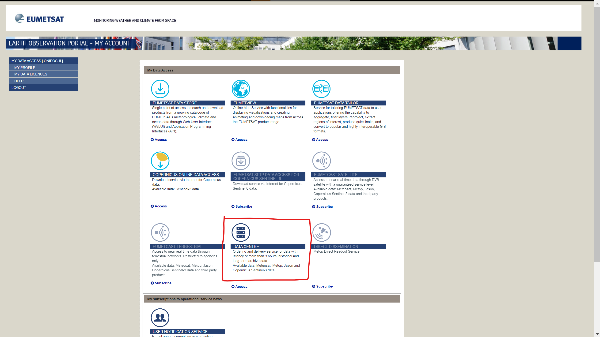
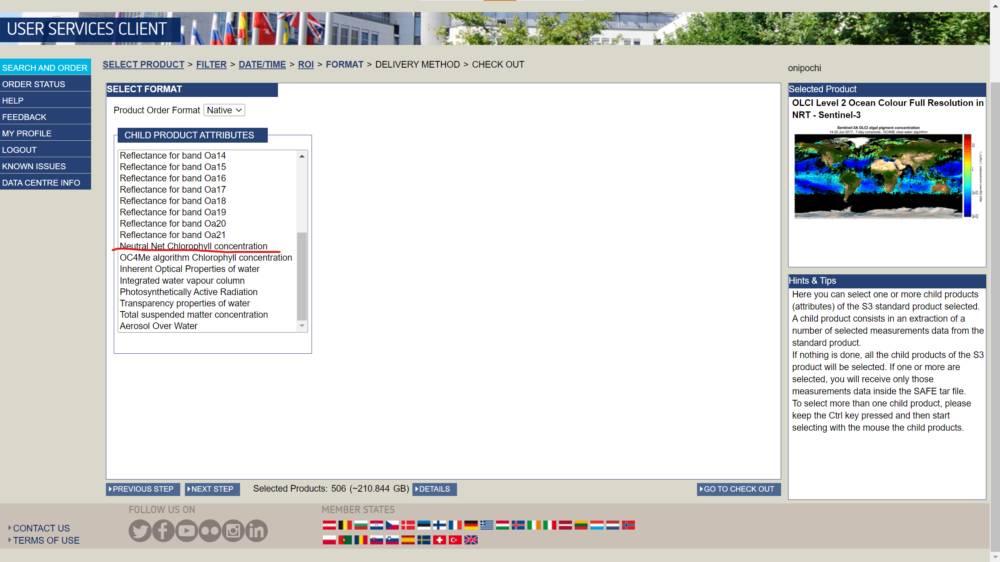

# EUMETSATオフィシャルサイトからのSentinel-3 OCLIダウンロード方法

## 手順

### EUMETSATのオフィシャルサイト

Sentinel-3の海色データは[Opernicus Online Data Access](https://github.com/a9455/G-Portal.git)でダウンロードが可能だが、直近1年間しか公開されていない。

上記での公開が終わったデータについては、[EUMETSAT DATA Centre](https://github.com/a9455/G-Portal.git)で公開されている。以下では、EUMETSAT DATA Centreからダウンロードする手順を紹介する

### EUMETSAT EARTH OBSERVATION PORTALへの登録

[こちら](https://eoportal.eumetsat.int/userMgmt/protected/welcome.faces)からEarth Observation Portalにログインする.以下の赤枠で囲っているところをクリックする。

またアカウントを持っていない方は[こちら](https://eoportal.eumetsat.int/userMgmt/register.faces)から。

### データを選択する

以下の画面がまず出てくる。ここで「Product」の真ん中くらいに「OLCI Level 2 Ocean Full Colour Full Resolution in NRT - Sentinel-3」などがある。Reduced Resolutionも選べるし、SSTを取得するためのSLSTRも下の方で選択が可能。選択して「NEXT STEP」を押す。次にオプションを選択する画面が出てくるが、任意のオプションを選んで「NEXT STEP」を押す。

### 期間を選択する

対象の期間を入れる。ここで例えば2019/01/01～2020/01/01の1年間のデータをダウンロードしたいとしよう。しかし、下記のような画面が表示されると思う。

期間が長いと対象のデータが多すぎる、ということなのだが、では、長期間の一括ダウンロードができないか、というと以下の手順で回避することが可能。

まず、一旦1日程度の期間に設定して検索を行う。すると、「NEXT STEP」がクリック可能になるのでクリックして次の画面に行く。

次の画面で取得したい領域(ROI)の指定が可能になる。対象領域に移動して拡大するために、「Pan/Zoom the map」をクリックし、地図を動かせるようにする。マウスホイールで拡大・縮小、ドラッグで地図を移動することが可能になる。これで対象領域を十分選択可能な地図を画面上に表示できたら、「Define Area of Interest」をクリックして、地図上をマウスでドラッグして矩形の選択範囲を作成する。

この状態でPREVIOUS STEPを押して期間の指定画面に戻る。すると、対象領域を持つデータだけが検索されて、対象のデータが多すぎる、というメッセージが出なくなる。
(もちろん上記で指定した領域が広ければ同様のエラーメッセージが出ることは十分考えらえる。)

但し、最終的にダウンロードの申請を行う時にファイル数が多すぎると、やはりエラーが出る。筆者が試した範囲では、6ヶ月くらいならばダウンロードが可能であった。ので、6ヶ月程度で指定するのがよいかと思われる(他の事例の報告歓迎します)

### 内容の選択

Sentinel-3に含まれるプロダクトの中からダウンロードしたいものを選択する。
クロロフィルaや(アルゴリズムの違いで二種類ある)懸濁物質、各バンドの結果などが選択できる。コントロールキーを押して選択すれば複数選択することが可能。選択した数だけ容量が当然増えるので、一度でダウンロードできる期間が減るものと思われる。

緯度経度の情報が入ったnetCDFファイル`geo_coordinates.nc`は選択しなくても自動的に含まれる。選択してNEXT STEPを押す。

### orderを発注する

Delivery methodはOnline HTTPを選択しNEXT STEPを押す。するとEstimated Order Size(GB)というのがでてくる。「PLACE YOUR ORDER」を押すと、ダウンロードするための発注を行う。この発注が準備されダウンロードできるようになるためには暫く時間がかかり(注文容量によっては半日ほど)、ダウンロードできるようになったらメールで連絡が来る。

## 最後に

その他情報やご指摘あればお願いします。

